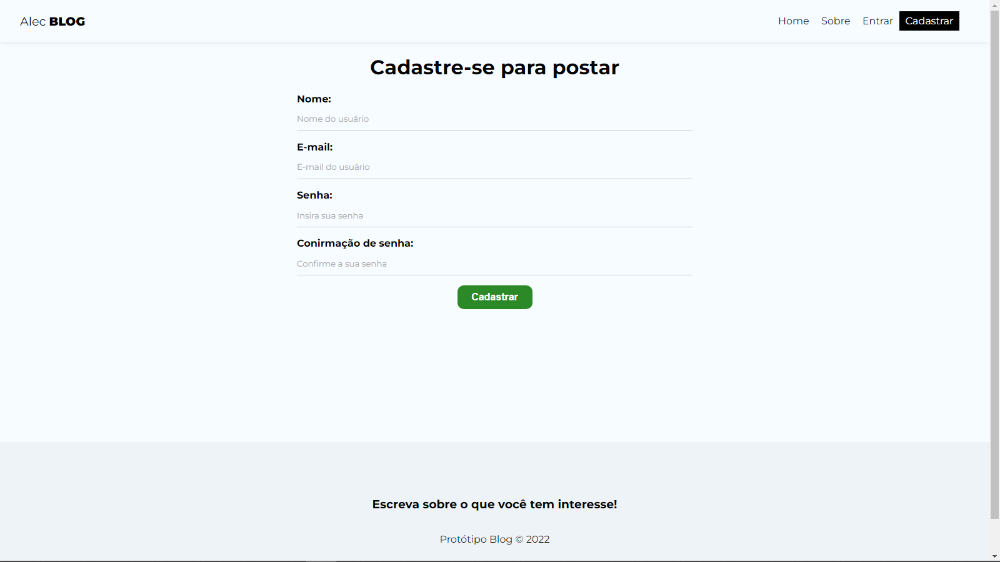
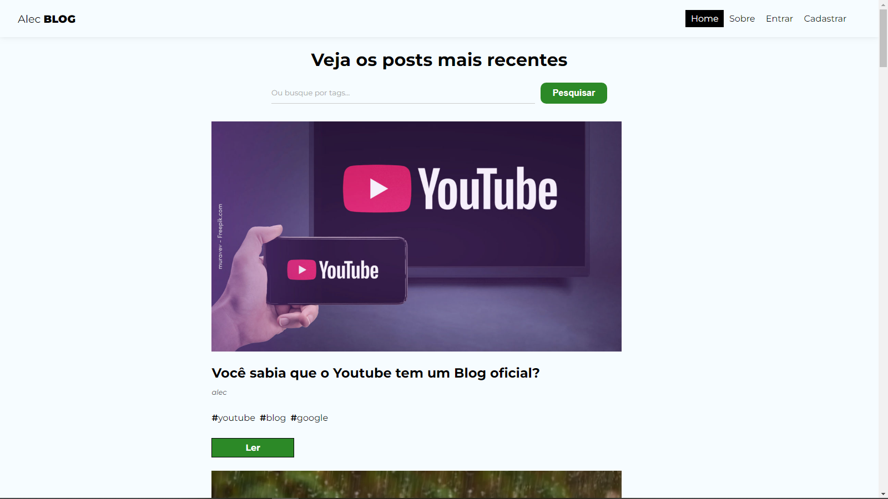

- Status do projeto: concluído ✔️

# `Blog 🔥`

## `Descrição do projeto`

Aplicação onde crio e estruturo um servidor real utilizando o Firebase como banco de dados e a Api do Google já disponível como back-end realizando a Autenticação de usuário.

### `Funcionalidades`

✔️ É possivel inserir uma foto no blog através da url da imagem.

✔️ No Dashboard você consegue editar, ver ou deletar a postagem.

✔️ Achar um publicação por `#hashtags`.

✔️ Ver postagem de outras pessoas.

✔️ Sistema de Autenticação de usuário.

## `Aplicação`

No link a seguir contém o Link da aplicação: [`Deploy`](https://myblog-reactjs.vercel.app/).

## `LAYOUT` 

Antes de você realizar sua postagem no blog você vai ter que se cadastrar.

### `TELA DE CADASTRO`

Após o cadastro suas postagens vão aparecer na tela inicial.

### `TELA INICIAL`

Postagem feita por todos os usuários.

